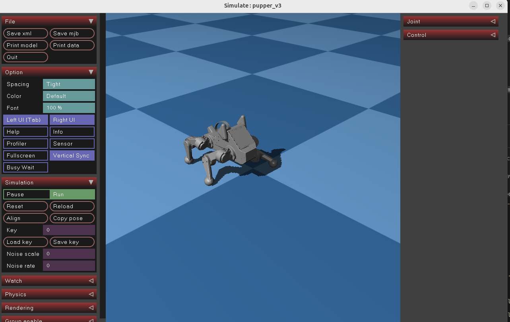

# neural_controller
This repository aims to ease the deployment of neural network control policies on robot hardware. It runs within the [ros2_control](https://github.com/ros-controls/ros2_control) framework and adopts [RTNeural](https://github.com/jatinchowdhury18/RTNeural) for real-time inference.

## Motivation
Getting a policy up and running on real hardware can be surprisingly tricky. Many opportunities exist for mistakes in processing the observations and actions. 
Furthermore, common neural network libraries such as Torch are not designed to run in a real-time control loop, introducing latency/jitter that increases the difficulty of sim-to-real transfer. 

# Install
`git clone git@github.com:G-Levine/neural_controller.git --recurse-submodules` \
(Submodules must be recursively cloned)

# Use

## Simulate pupper with a RL policy
### Requirements
Clone these recursively to `ros2_ws/src/`
* https://github.com/G-Levine/pupper_v3_description
* https://github.com/Nate711/pupperv3_mujoco_sim

Install requisite packages
* `sudo apt install glfw`
* `sudo rosdep init`
* `rosdep update`

Build
* `cd ros2_ws`
* `colcon build --symlink-install --cmake-args -DCMAKE_BUILD_TYPE=RelWithDebInfo`
* We recommend aliasing the above command to `build`

### Simulate
* Connect PS4/PS5 gamepad to computer via bluetooth
* `source install/local_setup.bash`
* `ros2 launch neural_controller launch_sim.py`
* Control the robot with the gamepad in the mujoco simulator!



### Use latest model from WandB
* `pip install wandb`
* `python3 download_latest_policy.py`
   * Or specific run number: `python3 download_latest_policy.py --run_number=167`
   * The script will ask you to provide your WandB API key
   * The script is hardcoded to use models from the `hands-on-robotics/pupperv3-mjx-rl` project so change if necessary.
* This will download the policy .json file to launch folder as `policy_latest.json`
* Set `model_path` in your `launch/config.yaml` as `model_path: "$(find-pkg-share neural_controller)/launch/policy_latest.json"`
* Build 
* Run using command above

# Functionality
## Inputs
- Maps hardware_interface states and ROS topics (such as cmd_vel) to the policy observation vector
- Performs processing such as quaternion-to-gravity-vector conversion
- Allows for parts of the observation vector to be hardcoded as fixed values

## Outputs
- Performs scaling/normalization on the actions
- Maps the policy action vector to hardware_interface commands

## Convenience and safety features
- On startup, smoothly returns the robot to a predefined starting pose
- Triggers an emergency stop when safety limits are exceeded (joint velocity, body pitch, etc.)

## How to configure
```
# Names of the joints in the order expected by the policy
joint_names:
    - "left_hip"
    - "left_knee"
    - "left_wheel"
    - "right_hip"
    - "right_knee"
    - "right_wheel"

# Position gains of the joints
kps:
    left_hip: 20.0
    left_knee: 20.0
    left_wheel: 0.0
    right_hip: 20.0
    right_knee: 20.0
    right_wheel: 0.0

# Velocity gains of the joints
kds:
    left_hip: 2.0
    left_knee: 2.0
    left_wheel: 0.5
    right_hip: 2.0
    right_knee: 2.0
    right_wheel: 0.5

# Type of action for each joint (position or velocity)
action_types:
    left_hip: "P"
    left_knee: "P"
    left_wheel: "V"
    right_hip: "P"
    right_knee: "P"
    right_wheel: "V"

# Center of the observation/action range for each joint
default_joint_pos:
    left_hip: 2.0
    left_knee: 2.0
    left_wheel: 0.0
    right_hip: 2.0
    right_knee: 2.0
    right_wheel: 0.0

# Observation and action scaling factors
obs_ang_vel_scale: 1.0

obs_joint_pos_scale: 1.0
obs_joint_vel_scale: 1.0

action_joint_pos_scale: 1.0
action_joint_vel_scale: 1.0

cmd_lin_vel_scale: 1.0
cmd_ang_vel_scale: 1.0
```